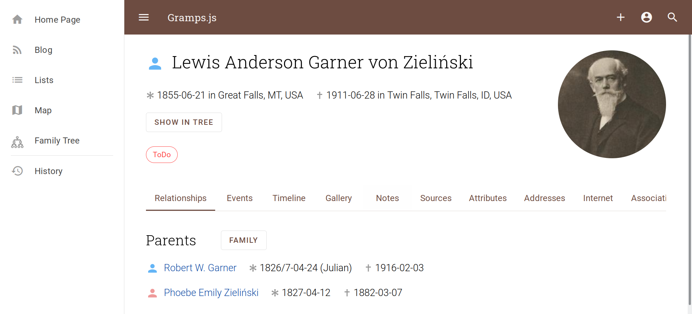

# Gramps Web &ndash; Frontend

Welcome to **Gramps Web**, a modern, feature-packed, free & open source web app for browsing and collaboratively editing genealogical databases. Fully interoperable with the [Gramps](https://gramps-project.org) desktop application, Gramps Web brings your family history to the web, making it accessible from anywhere and easy to share.

## What is Gramps Web?

**Gramps Web** is a web based application, ideally suited for collaborating with others to build your family tree together. It can be accessed from any mobile or portable web-enabled device. Gramps Web is free & open source software, with the privacy and control of your data a top priority.

Gramps Web is designed to be a companion to [Gramps Desktop](https://gramps-project.org), the leading open source genealogy desktop application.

Key highlights of Gramps Web include:

- 🌐 **Access Anywhere:** Browse and edit your family tree on any web-enabled device.
- 🤝 **Collaborative Features:** Share and collaborate with family members in real-time.
- 🔒 **Privacy First:** Advanced privacy controls ensure your data stays secure.
- 🗺️ **Interactive Visualizations:** Family tree charts, dynamic maps, and more.
- 🧩 **Bi-Directional Sync:** Seamlessly sync data between Gramps Web and Gramps Desktop.

[Learn More at grampsweb.org ➡️](https://www.grampsweb.org/)

## Features at a Glance

- **Interactive Family Tree Charts:** Explore ancestor, descendant, fan, and hourglass charts with ease.
- **Powerful Mapping Tools:** Visualize places on interactive maps, including custom overlays for historical maps.
- **Integrated Blog:** Document your research in story format with images, all stored in the Gramps database.
- **Advanced Search:** Search all record types with support for wildcards and logical operators.
- **DNA & Chromosome Tools:** View DNA matches and analyze chromosome data.
- **AI Chat Assistant:** Chat with your family tree, in your native language, powered by AI.
- **Full Customization & Internationalization:** Switch between 40+ languages and export your data any time.

## Screenshot

## Try It Out

### [Live Demo](https://demo.grampsweb.org/)
Experience Gramps Web with our demo deployment.

Login credentials: `owner`, `editor`, `contributor`, or `member` (same as password).

**Note:** some features (like AI chat) are not available in the demo deployment.

## Documentation

The documentation of Gramps Web is hosted at [www.grampsweb.org](https://www.grampsweb.org/):

- **[Features](https://www.grampsweb.org/features/):** Explore the key capabilities of Gramps Web.
- **[Install/Setup](https://www.grampsweb.org/install_setup/setup/):** Step-by-step guide to setting up Gramps Web.
- **[Administration](https://www.grampsweb.org/administration/admin/):** Learn how to manage and maintain your Gramps Web instance.
- **[User Guide](https://www.grampsweb.org/user-guide/):** Detailed instructions for everyday users.
- **[Developers](https://www.grampsweb.org/development/dev/):** Dive into the codebase and technical details.
- **[Contribute](https://www.grampsweb.org/contribute/contribute/):** Find out how you can support the project.
- **[Get Help](https://www.grampsweb.org/help/help/):** Access support resources and FAQs.

## Contribute

We'd love your feedback and contributions! Star this repository, fork it, and join us in making family history more accessible to everyone. Check out the [contribution guidelines](https://github.com/gramps-project/gramps-web/blob/main/CONTRIBUTING.md) to get started.

## Reporting issues

Note that this Github repository contains the source code of the Gramps Web user interface (frontend). For issues with the server-side code, please see the [Gramps Web API](https://github.com/gramps-project/gramps-web-api) (backend) repository. See [Get Help](https://www.grampsweb.org/help/help/) for more details.

## Roadmap

Gramps Web does not follow a fixed-date roadmap. However, you can explore prioritized feature requests and ongoing development efforts via our [development board](https://github.com/orgs/gramps-project/projects/1/views/1). This board provides an up-to-date view of what the developers are working on and what's coming next. Note that the roadmap reflects the current priorities of existing developers, not a restriction on what can be contributed.

